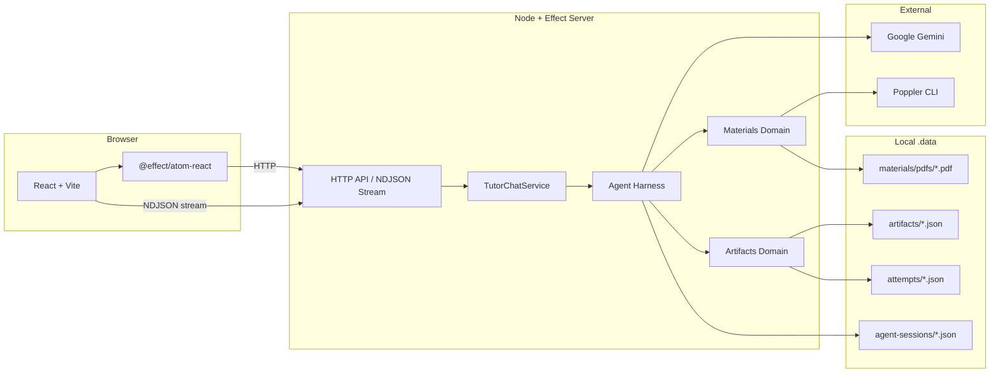
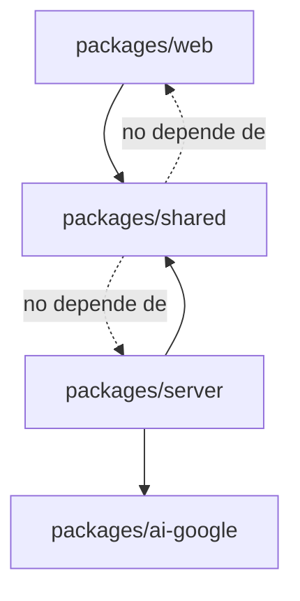
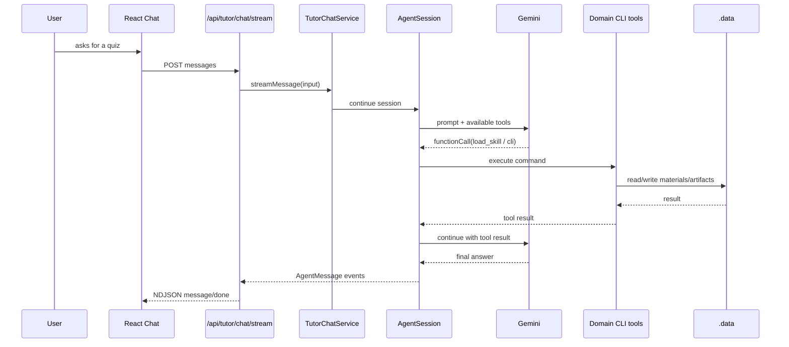

# Arquitectura

## Vista general

El repo está organizado como monorepo `pnpm`:

- `packages/shared`: contratos de API y schemas compartidos.
- `packages/server`: dominio, infraestructura y transporte HTTP.
- `packages/web`: UI React y estado cliente.
- `packages/ai-google`: integración local de Google AI para Effect.

## Dirección de dependencias

`shared` no debería depender de `server` ni de `web`. Es la capa que evita que el contrato HTTP se duplique manualmente en ambos lados.

## Shared: contratos y schemas

Archivos principales:

- `packages/shared/src/api/Api.ts`
- `packages/shared/src/api/tutor.ts`
- `packages/shared/src/api/materials.ts`
- `packages/shared/src/api/artifacts.ts`
- `packages/shared/src/schemas/*`

Aquí se definen endpoints con Effect HTTP API y schemas con `Schema`. El server los implementa y la web los consume.

## Server: dominio, infra y transporte

Entrada:

- `packages/server/src/index.ts`

Transporte HTTP:

- `packages/server/src/transport/http/server.ts`
- `packages/server/src/transport/http/handlers.ts`

Dominio:

- `packages/server/src/domain/agents/*`
- `packages/server/src/domain/artifacts/*`
- `packages/server/src/domain/materials/*`

Infraestructura:

- `packages/server/src/infra/artifacts/file-artifact-repository.ts`
- `packages/server/src/infra/materials/file-material-repository.ts`
- `packages/server/src/infra/materials/poppler-pdf-service.ts`

La composición de dependencias vive principalmente en `server.ts`, usando `Layer` de Effect y `@effect/platform-node`.

## Tutor agent

El tutor está implementado como un harness de agente con herramientas públicas:

- `load_skill`: carga instrucciones especializadas.
- `cli`: ejecuta comandos permitidos del dominio.

Las skills no se exponen como tools directas; el modelo debe cargarlas mediante `load_skill`.

Puntos de entrada:

- `packages/server/src/domain/agents/academic-tutor.ts`
- `packages/server/src/domain/agents/academic-tutor/tutor-chat-service.ts`
- `packages/server/src/domain/agents/harness/session.ts`

## Web: estado y UI

Entrada:

- `packages/web/src/App.tsx`

Componentes principales:

- `packages/web/src/components/Sidebar.tsx`
- `packages/web/src/components/Chat.tsx`
- `packages/web/src/components/ArtifactWorkspace.tsx`

Estado remoto con Effect Atom:

- `packages/web/src/domain/materials/atoms.ts`
- `packages/web/src/domain/artifacts/atoms.ts`
- `packages/web/src/domain/tutor/atoms.ts`

Streaming tutor:

- `packages/web/src/domain/tutor/stream.ts`

La UI mantiene estado local para cosas efímeras como input del chat, artifact seleccionado y respuestas del formulario.

## Trade-offs actuales

- Persistencia por filesystem: simple y fácil de inspeccionar, no orientada a concurrencia fuerte.
- Algunas rutas usan Effect HTTP API; el stream del chat usa NDJSON manual.
- Hay schemas de artifacts en `shared` y dominio server; hay que evitar drift si se cambian.
- El proyecto prioriza legibilidad para challenge sobre completitud productiva.
